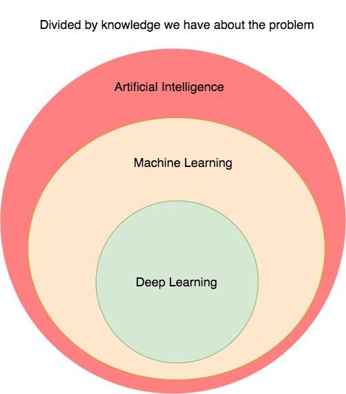
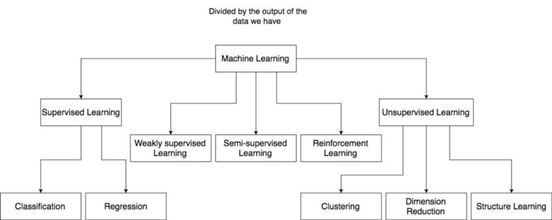

This is my first post on Machine Learning, Deep Learning and Computer Vision series in Medium. I am currently a Ph.D. Student in Computer Science with research interests are Computer Vision and Machine Learning. On this series, I will share with you the roadmap I have experienced. I hope that everything I share is somehow helps you save time when exploring Machine Learning field.

First, I will discuss about the relationship between Machine Learning and other areas. Artificial Intelligence is a branch of Computer Science which deals with the automation of solving problem. I mean the problems here are not all the problems in the world, just a small part of problems which can be represented as a format that computer can understand. In particular, this is the problem can represented as input and output such as the problem of image classification. The input here is an image and the output is the label of that image. In Artificial Intelligence, there are two kinds of approach, one is to use hard-coded rules and one is to use learnable rules. The approaches that use hard-coded rule or heuristic can be used in solving simple games like Tic-tac-toe (large board version) or Chess. They apply a predefined rule to the input. For example, in chess they evaluate the value of different next-moves based on a human experience. Besides, the approaches that use learnable rules is called Machine Learning. These rules are not pre-defined by an expert but learned from the data itself.

We cannot say which approach is better, it depends on the data and the expert knowledge you have for that problem. If your problems already have expert knowledge, you can use heuristic approach like in Tic-tac-to or Chess. However, the number of problems that can have an expert knowledge is very small comparing to non-expert knowledge problem. So right now the most active part of Artificial Intelligence is Machine Learning which solving the non-expert knowledge problem. In Machine Learning itself, there are several approaches to solve the non-expert knowledge problem. The input to the problem can have many features, if you know exactly which features are importantly contributing to predicting the final output you can use normal Machine Learning algorithm like SVM, Random Forest or Shallow Neural Network and so on to solve. However, there are a lot of problems that you do not know exactly which features contributing to the prediction to the final output. In these cases, you can use Deep Learning to automatically learn the important features.

So we can see that, which approaches to use in Artificial Intelligence is depending on the knowledge you know about the problem. There is no best approach for all problems. Next, I will discuss some several kinds of problems in Machine Learning.

In Machine Learning, we can divide the problems based on the level of supervision of the data. The first one is Supervised Learning. The data you have is in the form of input and output and the output here is exactly what you need. For instance, with image classification problem. The input here is an image of an object and the output is the label of that object. There are two tasks in supervised learning: Classification and Regression. The output in Classification is a discrete value where the output in Regression is a continuous value. For example, given the image of a dog or a cat, you will classify it as dog or cat label. With the regression, we can take the example of predicting the values of a house given the particular features like its position, its current condition and so on.

The second type of problems in Machine Learning is Unsupervised Learning. In that case, the data is just input and you do not know the output. Normally, we have several problems like Clustering, Dimension Reduction or Structure Learning. And the third type of problems in Machine Learning is between the supervised learning and unsupervised learning. We can have 3 sub-divisions: weakly supervised learning, semi-supervised and reinforcement learning. With weakly supervised learning, the label is not exactly the final output we want but correlated to the final output. For example, in the weakly supervised object localization problem, the final output we want is the object bounding box in the image, but the cost of obtaining these label is very expensive, so instead, we have the label of object in the image like a cat or a dog. As a human, if we know the what kind of object we can easily know the position of that object in the image.

With semi-supervised learning, we do not have the output of all inputs. The input having corresponding output is just a small number comparing to the inputs that we do not have output because of the cost of obtaining full outputs for all inputs is expensive. Finally, with reinforcement learning we do not have the exact output as well as the highly correlated label. Instead, we just have the signal of doing following action is good or not such as the problem of object localization without the notion of ground-truth bounding box or object label. Here, we just have the signal of recognized correct object in the image. If the bounding box is correct then the score of recognizing object will be higher than incorrect bounding box. That gives us a signal or a hint of finding correct bounding box. Therefore, depending on what types of data you have, you will choose the appropriate machine learning algorithms.
To summarize what we have discussed so far on the first post, you can look at the following diagrams:

